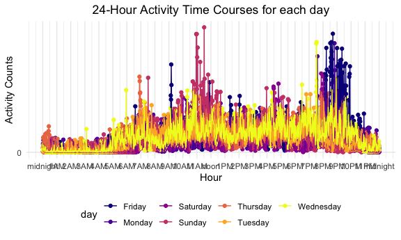

Homework 3
================
Kevin Patterson

# Problem 1

``` r
data("instacart")
```

This dataset contains 1384617 rows and 15 columns.

Observations are the level of items in orders by user. There are user
and order variables – user ID, order ID, order day, and order hour.
There are also item variables – name, aisle, department, and some
numeric codes.

How many aisles, and which are most items from?

``` r
instacart %>%
  count(aisle) %>%
  arrange(desc(n))
```

    ## # A tibble: 134 x 2
    ##    aisle                              n
    ##    <chr>                          <int>
    ##  1 fresh vegetables              150609
    ##  2 fresh fruits                  150473
    ##  3 packaged vegetables fruits     78493
    ##  4 yogurt                         55240
    ##  5 packaged cheese                41699
    ##  6 water seltzer sparkling water  36617
    ##  7 milk                           32644
    ##  8 chips pretzels                 31269
    ##  9 soy lactosefree                26240
    ## 10 bread                          23635
    ## # … with 124 more rows

There are 134 aisles and the most items ordered are from fresh
vegetables aisle (n=150,609), fresh fruits aisle (n=150,473), followed
by packaged vegetables and fruits aisle (n=78,493).

Let’s make a plot

``` r
instacart %>%
  count(aisle) %>%
  filter(n > 10000) %>%
  mutate(
    aisle = factor(aisle),
    aisle = fct_reorder(aisle, n)
  ) %>%
  ggplot(aes(x = aisle, y = n)) +
  geom_point() +
  theme(axis.text.x = element_text(angle = 90, vjust = 0.5, hjust = 1))
```


Let’s make a table

``` r
instacart %>%
  filter(aisle %in% c("baking ingredients", "dog food care", "packaged vegetables fruits")) %>%
  group_by(aisle) %>%
  count(product_name) %>%
  mutate(rank = min_rank(desc(n))) %>%
  filter(rank < 4) %>%
  arrange(aisle, rank) %>%
  knitr::kable()
```

| aisle                      | product\_name                                 |    n | rank |
| :------------------------- | :-------------------------------------------- | ---: | ---: |
| baking ingredients         | Light Brown Sugar                             |  499 |    1 |
| baking ingredients         | Pure Baking Soda                              |  387 |    2 |
| baking ingredients         | Cane Sugar                                    |  336 |    3 |
| dog food care              | Snack Sticks Chicken & Rice Recipe Dog Treats |   30 |    1 |
| dog food care              | Organix Chicken & Brown Rice Recipe           |   28 |    2 |
| dog food care              | Small Dog Biscuits                            |   26 |    3 |
| packaged vegetables fruits | Organic Baby Spinach                          | 9784 |    1 |
| packaged vegetables fruits | Organic Raspberries                           | 5546 |    2 |
| packaged vegetables fruits | Organic Blueberries                           | 4966 |    3 |

Let’s make a table on Apples vs. Ice Cream.

``` r
instacart %>%
  filter(product_name %in% c("Pink Lady Apples", "Coffee Ice Cream")) %>%
  group_by(product_name, order_dow) %>%
  summarize(mean_hour = mean(order_hour_of_day)) %>% 
  pivot_wider(
    names_from = order_dow,
    values_from = mean_hour
  )
```

    ## `summarise()` regrouping output by 'product_name' (override with `.groups` argument)

    ## # A tibble: 2 x 8
    ## # Groups:   product_name [2]
    ##   product_name       `0`   `1`   `2`   `3`   `4`   `5`   `6`
    ##   <chr>            <dbl> <dbl> <dbl> <dbl> <dbl> <dbl> <dbl>
    ## 1 Coffee Ice Cream  13.8  14.3  15.4  15.3  15.2  12.3  13.8
    ## 2 Pink Lady Apples  13.4  11.4  11.7  14.2  11.6  12.8  11.9

# Problem 2

Load, tidy, wrangle data.

``` r
accel_df = read_csv("./accel_data.csv") %>%
  janitor::clean_names() %>%
  pivot_longer(
    cols = activity_1:activity_1440,
    names_to = "minute",
    names_prefix = "activity_",
    values_to = "activity_counts") %>%
  mutate(week_type=case_when(day %in% c("Monday","Tuesday","Wednesday","Thursday","Friday") ~ "Weekday",
                           day %in% c("Saturday","Sunday") ~ "Weekend")
         )
```

    ## Parsed with column specification:
    ## cols(
    ##   .default = col_double(),
    ##   day = col_character()
    ## )

    ## See spec(...) for full column specifications.

Tidied dataset

``` r
accel_df%>%tibble()
```

    ## # A tibble: 50,400 x 6
    ##     week day_id day    minute activity_counts week_type
    ##    <dbl>  <dbl> <chr>  <chr>            <dbl> <chr>    
    ##  1     1      1 Friday 1                 88.4 Weekday  
    ##  2     1      1 Friday 2                 82.2 Weekday  
    ##  3     1      1 Friday 3                 64.4 Weekday  
    ##  4     1      1 Friday 4                 70.0 Weekday  
    ##  5     1      1 Friday 5                 75.0 Weekday  
    ##  6     1      1 Friday 6                 66.3 Weekday  
    ##  7     1      1 Friday 7                 53.8 Weekday  
    ##  8     1      1 Friday 8                 47.8 Weekday  
    ##  9     1      1 Friday 9                 55.5 Weekday  
    ## 10     1      1 Friday 10                43.0 Weekday  
    ## # … with 50,390 more rows

This new dataset contains 50400 rows and 6 columns. There are 50,400
observations of activity counts that correspond to the minute they were
recorded. There are 6 variables that include 5 weeks of accelerometer
observations, a `day_id` variable that corresponds to each day of the
study (n = 35 days), and a `week_type` variable that indicates whether
an observation was on a weekday or on the weekend.

Aggregate dataset across minutes to create a total activity variable for
each day.

``` r
accel_aggdf = accel_df %>%
  group_by(week, day_id, day) %>%
  summarize(activity_sum = sum(activity_counts)) %>%
  arrange(week) %>%
  rename("study day" = day_id,
         "total activity" = activity_sum)
```

    ## `summarise()` regrouping output by 'week', 'day_id' (override with `.groups` argument)

``` r
  knitr::kable(accel_aggdf)
```

| week | study day | day       | total activity |
| ---: | --------: | :-------- | -------------: |
|    1 |         1 | Friday    |      480542.62 |
|    1 |         2 | Monday    |       78828.07 |
|    1 |         3 | Saturday  |      376254.00 |
|    1 |         4 | Sunday    |      631105.00 |
|    1 |         5 | Thursday  |      355923.64 |
|    1 |         6 | Tuesday   |      307094.24 |
|    1 |         7 | Wednesday |      340115.01 |
|    2 |         8 | Friday    |      568839.00 |
|    2 |         9 | Monday    |      295431.00 |
|    2 |        10 | Saturday  |      607175.00 |
|    2 |        11 | Sunday    |      422018.00 |
|    2 |        12 | Thursday  |      474048.00 |
|    2 |        13 | Tuesday   |      423245.00 |
|    2 |        14 | Wednesday |      440962.00 |
|    3 |        15 | Friday    |      467420.00 |
|    3 |        16 | Monday    |      685910.00 |
|    3 |        17 | Saturday  |      382928.00 |
|    3 |        18 | Sunday    |      467052.00 |
|    3 |        19 | Thursday  |      371230.00 |
|    3 |        20 | Tuesday   |      381507.00 |
|    3 |        21 | Wednesday |      468869.00 |
|    4 |        22 | Friday    |      154049.00 |
|    4 |        23 | Monday    |      409450.00 |
|    4 |        24 | Saturday  |        1440.00 |
|    4 |        25 | Sunday    |      260617.00 |
|    4 |        26 | Thursday  |      340291.00 |
|    4 |        27 | Tuesday   |      319568.00 |
|    4 |        28 | Wednesday |      434460.00 |
|    5 |        29 | Friday    |      620860.00 |
|    5 |        30 | Monday    |      389080.00 |
|    5 |        31 | Saturday  |        1440.00 |
|    5 |        32 | Sunday    |      138421.00 |
|    5 |        33 | Thursday  |      549658.00 |
|    5 |        34 | Tuesday   |      367824.00 |
|    5 |        35 | Wednesday |      445366.00 |

The aggregated accelerometer dataset doesn’t seem to follow any
particular trend, I arranged by `week` initially to see if there was
increased or decreased activity as each week progressed, but there is no
such pattern observed. Then, I saw that higher `total activity` values
around Friday to Sunday, but after week 3 this pattern did not hold up.
There are very low values for `study day` 24 and 31, which might
indicate that less observations were taken on these two days resulting
in their outlier behavior. I also arranged by descending order of `total
activity` (not shown), but after reviewing the corresponding variables
(i.e., `week`, `day`, `study day`) no such pattern was observed.

Let’s make a single panel plot that shows 24-hour activity time courses
for each day (using viridis from library setup)

``` r
accel_actdf = accel_df %>%
  mutate(minute = as.numeric(minute),
         hour = minute / 60) %>%
  group_by(day, hour) %>%
  summarize(activity_sum = sum(activity_counts)) %>%
  ggplot(aes(x = hour, y = activity_sum)) +
  geom_point(aes(color = day)) + geom_line(aes(color = day)) +
  viridis::scale_color_viridis(name = "day",
                               discrete = "TRUE",
                               option = "plasma") +
  ggtitle("24-Hour Activity Time Courses for each day") +
  theme(plot.title = element_text(hjust = 0.5)) +
  labs(x = "Hour",
       y = "Activity Counts") +
  theme(legend.position = "bottom") +
  scale_x_continuous(breaks = c(0, 1, 2, 3, 4, 5, 6, 7, 8, 9, 10, 11, 12, 13, 14, 15, 16, 17, 18, 19, 20, 21, 22, 23, 24), 
                     labels = c("midnight", "1AM", "2AM", "3AM", "4AM", "5AM", "6AM", "7AM", "8AM", "9AM", "10AM", "11AM", "noon", "1PM", "2PM", "3PM", "4PM", "5PM", "6PM", "7PM", "8PM", "9PM", "10PM", "11PM", "midnight")) +
  scale_y_continuous(
    breaks = c(0, 50000, 100000, 150000, 200000, 250000, 300000, 350000),
    labels = c("0", "50,000", "100,0000", "150,000", "200,000", "250,000", "300,000", "350,000"))
```

    ## `summarise()` regrouping output by 'day' (override with `.groups` argument)

``` r
accel_actdf
```


The activity counts for the 63 year-old male are highest in the evenings
around 8PM to 9PM and then followed by counts at 11AM across all days.
As mentioned in the last question, it seemed that highest counts of
activity were around the weekend and the plot better illustrates the
highest activity counts on Fridays, Sundays, and Mondays. The male does
activity more around the mornings and evenings.

# Problem 3

Load NY NOAA dataset

``` r
library(p8105.datasets)
data("ny_noaa")
```

``` r
ny_noaa%>%tibble()
```

    ## # A tibble: 2,595,176 x 7
    ##    id          date        prcp  snow  snwd tmax  tmin 
    ##    <chr>       <date>     <int> <int> <int> <chr> <chr>
    ##  1 US1NYAB0001 2007-11-01    NA    NA    NA <NA>  <NA> 
    ##  2 US1NYAB0001 2007-11-02    NA    NA    NA <NA>  <NA> 
    ##  3 US1NYAB0001 2007-11-03    NA    NA    NA <NA>  <NA> 
    ##  4 US1NYAB0001 2007-11-04    NA    NA    NA <NA>  <NA> 
    ##  5 US1NYAB0001 2007-11-05    NA    NA    NA <NA>  <NA> 
    ##  6 US1NYAB0001 2007-11-06    NA    NA    NA <NA>  <NA> 
    ##  7 US1NYAB0001 2007-11-07    NA    NA    NA <NA>  <NA> 
    ##  8 US1NYAB0001 2007-11-08    NA    NA    NA <NA>  <NA> 
    ##  9 US1NYAB0001 2007-11-09    NA    NA    NA <NA>  <NA> 
    ## 10 US1NYAB0001 2007-11-10    NA    NA    NA <NA>  <NA> 
    ## # … with 2,595,166 more rows

This dataset contains 2595176 rows and 7 columns. This dataset has
2,595,176 observatons and 7 variables that include a weather station id,
date of observation, (tenths of mm), snowfall (mm), snow depth (mm),
maximum and minimum temperatures (tenths of degree C). There are missing
data for `prcp`, `snow`, `snwd`, `tmax`, and `tmin` variables. The
dataset has recorded data from January 1, 1981 through Decmber 31, 2010
from the National Oceanic and Atmospheric Association of the National
Centers for Environmental Information.
